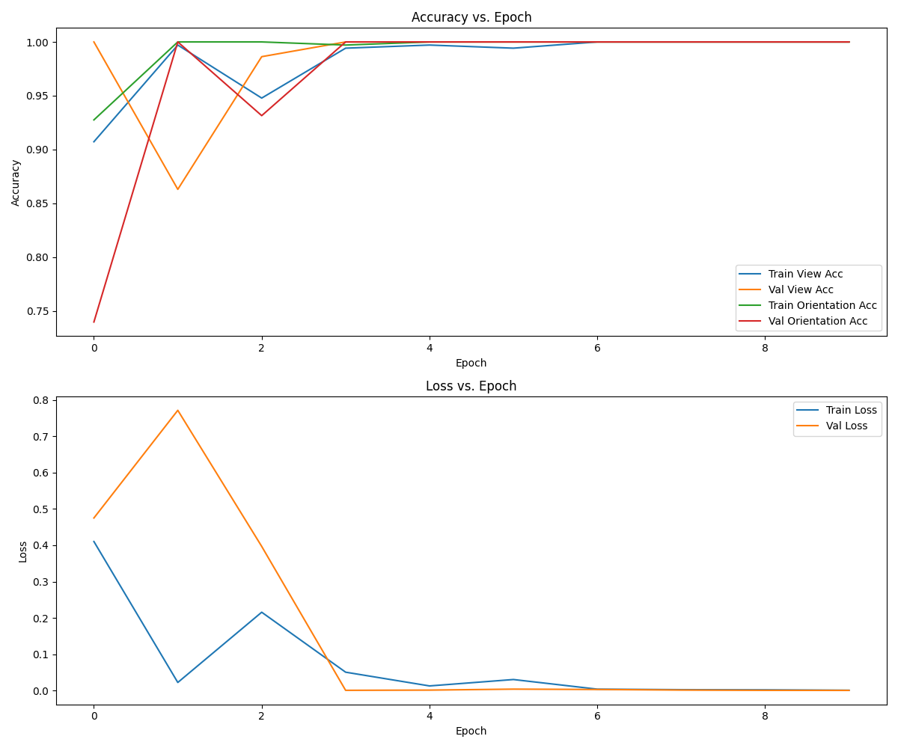

# MammoQC

MammoQC is a comprehensive tool for mammography quality control and analysis. It includes three main components: nipple detection, pectoral muscle segmentation, and view-orientation classification. This project uses advanced deep learning techniques to analyze mammogram images and provide valuable insights for medical professionals.

## Table of Contents
- [Features](#features)
- [Installation](#installation)
- [Usage](#usage)
  - [Nipple Detection](#nipple-detection)
  - [Pectoral Muscle Segmentation](#pectoral-muscle-segmentation)
  - [View-Orientation Classification](#view-orientation-classification)
- [Dataset Information](#dataset-information)
  - [Dataset Overview](#dataset-overview)
  - [About the VINDR Dataset](#dataset-about)
  - [Our Subset](#dataset-our-subset)
  - [Limitations](#dataset-limitations)
  - [Citation](#dataset-citation)
- [Training](#training)
  - [Nipple Detector (YOLO)](#nipple-detector-yolo)
  - [Pectoral Muscle Segmentation (U-Net)](#pectoral-muscle-segmentation-u-net)
  - [View-Orientation Classification (Res2Next)](#view-orientation-classification-res2next)
- [Example Outputs](#example-outputs)
- [Project Structure](#project-structure)
- [Dependencies](#dependencies)
- [Future Work Checklist](#future-work-checklist)
- [License](#license)

## Features

1. **Nipple Detection**: Utilizes YOLOv8 to accurately locate nipples in mammogram images.
2. **Pectoral Muscle Segmentation**: Implements a U-Net architecture to segment pectoral muscles in mammograms.
3. **View-Orientation Classification**: Uses a Res2Next model to classify mammogram views (CC/MLO) and orientations (Left/Right).

## Installation

1. Clone the repository:
   ```
   git clone https://github.com/yourusername/MammoQC.git
   cd MammoQC
   ```

2. Set up a virtual environment (optional but recommended):
   ```
   python -m venv venv
   source venv/bin/activate  # On Windows, use `venv\Scripts\activate`
   ```

3. Install PyTorch:
   **Important**: Install PyTorch separately using the command from the official PyTorch website. Select the relevant version of CUDA for your system. For example:
   ```
   pip3 install torch torchvision --index-url https://download.pytorch.org/whl/cu118
   ```

4. Install the required dependencies:
   ```
   pip install -r requirements.txt
   ```

## Usage

### Nipple Detection

To run nipple detection on a set of images:

```
python inference/nipple_detection_inference.py -c path/to/checkpoint -i path/to/image/directory
```

Options:
- `-c`, `--checkpoint_path`: Path to the model checkpoint (default: `D:\Code\MammoQC\runs\detect\train4\weights\best.pt`)
- `-i`, `--image_dir`: Path to the input image directory (default: `inference/inference_imgs`)

### Pectoral Muscle Segmentation

To perform pectoral muscle segmentation:

```
python inference/pectoral_muscle_segmentation_inference.py -c path/to/checkpoint -i path/to/image/directory
```

Options:
- `-c`, `--checkpoint_path`: Path to the model checkpoint (default: `checkpoints/pectoral-segmentation-unet-512-epoch=06-val_dice_coeff=0.97.ckpt`)
- `-i`, `--image_dir`: Path to the input image directory (default: `inference/inference_imgs`)

### View-Orientation Classification

To classify mammogram views and orientations:

```
python inference/view_orientation_clasiffication_inference.py -c path/to/checkpoint -i path/to/image/directory
```

Options:
- `-c`, `--checkpoint_path`: Path to the model checkpoint (default: `checkpoints/res2next-mammography-epoch=09-val_loss=0.00.ckpt`)
- `-i`, `--image_dir`: Path to the input image directory (default: `inference/inference_imgs`)


## Dataset Information

All models in this project were trained using a carefully curated subset of the VINDR mammography dataset. Here are the key details about our training data:

### Dataset Overview
- **Source**: VINDR mammography dataset
- **Subset Size**: 500 images
- **Image Types**: Full-field digital mammograms (FFDM)
- **Views**: Includes both Craniocaudal (CC) and Mediolateral Oblique (MLO) views
- **Orientations**: Includes both Left and Right breast images

### About the VINDR Dataset
The VINDR dataset is a large-scale mammography dataset from Vietnam, containing over 100,000 images. It was created to support the development and evaluation of AI systems for breast cancer screening and diagnosis.

### Our Subset
We selected a diverse subset of 500 images to ensure our models are trained on a representative sample of mammography images. This subset was chosen to include:
- A balanced distribution of CC and MLO views
- An equal representation of Left and Right breast images
- A variety of breast densities and pathological findings

### Limitations
While our models have been trained on this carefully selected subset, users should be aware of the following limitations:
1. The models may not capture the full variability present in the entire VINDR dataset.
2. Performance may vary on mammography images from other sources or populations.
3. The relatively small training set size (500 images) may limit the models' generalization capabilities.

### Citation
If you use our models or reference this dataset, please cite the original VINDR dataset paper:

```
Ha Q. Nguyen, Khanh Lam, Linh T. Le, Hieu H. Pham, Dat Q. Tran, Dung B. Nguyen, 
Dung D. Le, Sandeep M. M. Theetha, Pushpak Pati, Mathias Brandstötter, et al. 
"VinDr-Mammo: A large-scale benchmark dataset for computer-aided detection and 
diagnosis in full-field digital mammography." arXiv preprint arXiv:2203.08041 (2022).
```

For more information about the VINDR dataset, visit their [official website](https://vindr.ai/datasets/mammography).

## Training

### Nipple Detector (YOLO)

To train the nipple detector:

```
python train/nipple_detector_yolo.py
```

This script uses YOLOv8 for nipple detection. It loads a pre-trained YOLOv8 model and fine-tunes it on mammogram data. The training process includes data augmentation and uses the YOLO-specific loss function.

### Pectoral Muscle Segmentation (U-Net)

To train the pectoral muscle segmentation model:

```
python train/pectoral_muscle_segmentator_512.py
```

This script implements a U-Net architecture for pectoral muscle segmentation. It uses a combination of binary cross-entropy and Dice loss for training. The model is trained on 512x512 pixel images and includes data augmentation techniques.

### View-Orientation Classification (Res2Next)

To train the view-orientation classifier:

```
python train/view_orientation_classifier.py
```

This script uses a Res2Next50 model for classifying mammogram views (CC/MLO) and orientations (Left/Right). It implements a multi-task learning approach, with separate classifiers for view and orientation. The training process includes data augmentation and uses cross-entropy loss.


## Model Performance

### Nipple Detection Model

The Nipple Detection model, based on YOLOv8, was trained for 200 epochs. Here are the final performance metrics:

- **Precision (B)**: 1.0
- **Recall (B)**: 0.98544
- **mAP50 (B)**: 0.99279
- **mAP50-95 (B)**: 0.56041

These results indicate that the Nipple Detection model achieves high accuracy in identifying nipples in mammogram images, with perfect precision and near-perfect recall. The high mAP50 score demonstrates excellent performance at a 50% IoU threshold, while the mAP50-95 score shows good performance across various IoU thresholds.

### Pectoral Muscle Segmentation

### View-Orientation Classification


The View-Orientation Classification model, designed to classify mammogram images by view (CC/MLO) and orientation (Left/Right), demonstrated excellent performance during training.

The model achieved rapid improvement in accuracy for both view and orientation classification, reaching nearly 100% by the fourth epoch. This high accuracy was maintained consistently for both training and validation sets, indicating strong generalization capabilities.
Training and validation losses decreased sharply in the initial epochs and stabilized at very low values, suggesting successful model convergence with minimal overfitting. The final model achieved near-perfect accuracy on both training and validation sets for view and orientation classification.

These results indicate that the View-Orientation Classification model is highly effective at distinguishing between different mammogram views and orientations, a crucial capability for accurate analysis within the MammoQC system.

## Example Outputs

### Nipple Detection


These images show the results of our nipple detection model. The red boxes indicate the detected nipple locations in right mediolateral oblique (R-MLO) and left craniocaudal (L-CC) views.

### Pectoral Muscle Segmentation


These images demonstrate the pectoral muscle segmentation capabilities of our model. The left side shows the original mammogram, while the right side displays the segmentation mask. The red area in the segmentation mask represents the detected pectoral muscle region.

### View-Orientation Classification

Our view-orientation classification model accurately identifies the view (CC/MLO) and orientation (Left/Right) of mammogram images. This information is crucial for proper analysis and comparison of mammograms.

These example outputs showcase the effectiveness of MammoQC in performing key tasks in mammogram analysis, aiding in the overall quality control and interpretation process.

## Project Structure

```
MammoQC/
├── checkpoints/
├── inference/
│   ├── inference_imgs/
│   ├── nipple_detection_inference.py
│   ├── pectoral_muscle_segmentation_inference.py
│   └── view_orientation_clasiffication_inference.py
├── lightning_logs/
├── preprocessing/
├── runs/
├── train/
│   ├── nipple_detector_yolo.py
│   ├── pectoral_muscle_segmentator_512.py
│   └── view_orientation_classifier.py
├── venv/
├── .gitignore
├── annotations.xml
├── LICENSE
├── README.md
└── yolov8m.pt
```

## Dependencies

MammoQC relies on several Python libraries. The main dependencies include:

- PyTorch and torchvision (install separately as mentioned in the Installation section)
- PyTorch Lightning
- Ultralytics (for YOLOv8)
- OpenCV
- NumPy
- Pandas
- Matplotlib
- timm (for Res2Next model)

For a complete list of dependencies and their versions, please refer to the `requirements.txt` file in the repository.

**Note**: Some dependencies may require specific versions to ensure compatibility. It's recommended to use a virtual environment and install dependencies exactly as specified in the `requirements.txt` file.

## Future Work Checklist

Here's a list of features and improvements planned for the MammoQC project:

### Data Preprocessing
- [ ] Package the preprocessing pipeline for the VINDR dataset
  - [ ] Create a script to download and extract the VINDR dataset
  - [ ] Implement automatic data preprocessing steps (DICOM to PNG conversion, masks creation, etc.)
  - [ ] Document the preprocessing steps in detail

### Algorithm Development
- [ ] Create a full algorithm for Patient Position Quality Control
  - [ ] Merge all existing models (view classification, orientation detection, etc.)
  - [ ] Implement additional processing steps:
    - [ ] Breast boundary detection
    - [ ] Nipple visibility detection
  - [ ] Develop a scoring system for overall positioning quality
  - [ ] Create a comprehensive report generation feature

### User Interface
- [ ] Add a user-friendly UI
  - [ ] Design a clean and intuitive interface
  - [ ] Implement file upload functionality for mammogram images
  - [ ] Create a results display page with visualizations
  - [ ] Add batch processing capabilities
  - [ ] Implement result saving features

### Deployment
- [ ] Dockerize the application

### Testing and Validation
- [ ] Develop a comprehensive test suite
  - [ ] Unit tests for individual components
  - [ ] Integration tests for the full algorithm
  - [ ] Performance benchmarking on various hardware configurations

### Future Enhancements
- [ ] Handle other modalities (MRI?)
- [ ] Develop additional QC modules (e.g., compression, exposure)

## License

This project is licensed under the MIT Licence. See the `LICENSE` file for details.


