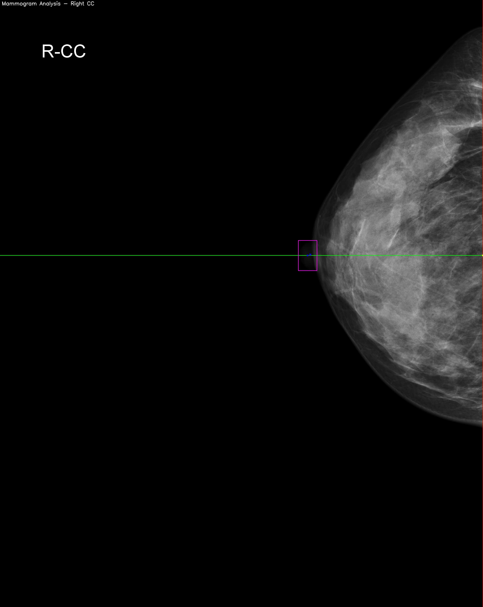
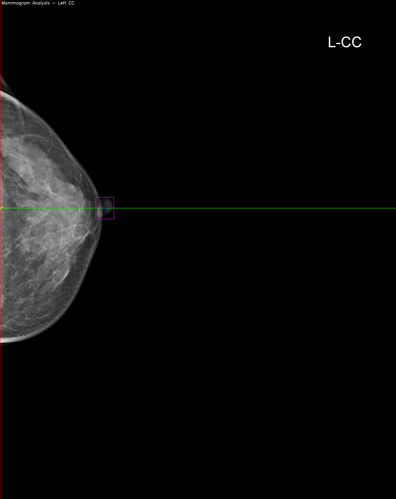
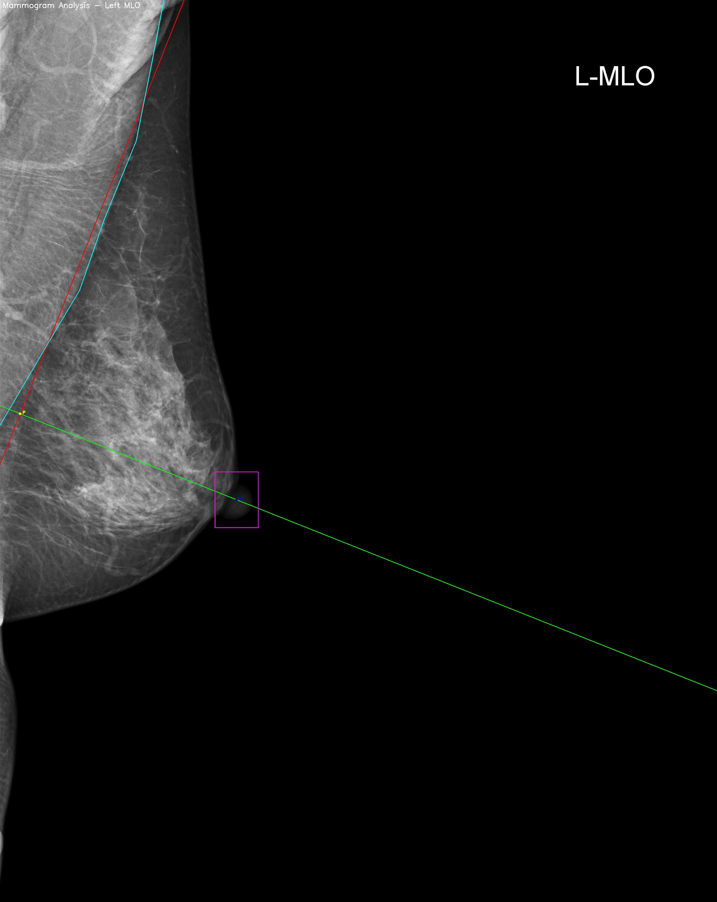

## Table of Contents
- [Pectoral Nipple Distance (PND) Calculation](#pnd)
   - [PND Definition](#pnd_definition)
   - [Importance](#pnd_importance)
   - [Implementation](#pnd_implementation)
   - [Usage](#pnd_usage)
   - [Output examples](#pnd_examples)

### Pectoral Nipple Distance (PND) Calculation

MammoQC includes a feature to calculate the Pectoral Nipple Distance (PND), an important metric in mammogram analysis. This feature is implemented in `logics/pnd.py`.

#### PND Definition:
- For CC (Craniocaudal) view: The PND is the distance from the nipple to the posterior edge of the image, measured as a straight line.
- For MLO (Mediolateral Oblique) view: Also called PNL (Pectoral Nipple Line), it's an imaginary line drawn perpendicular from the nipple to the pectoral muscle.

#### Importance:
1. Helps assess the amount of posterior breast tissue included in the CC view.
2. Used to evaluate positioning consistency between examinations and between CC and MLO views.

#### Implementation:
- The script handles both CC and MLO views, as well as Left and Right orientations.
- For MLO views, it uses a mask to detect the pectoral muscle edge.
- The algorithm calculates the intersection point between the nipple and the pectoral muscle or image edge.
- Visualizations are generated showing:
  - The detected nipple position
  - The pectoral muscle line or image edge
  - The perpendicular line from the nipple
  - The intersection point
  - The calculated distance

#### Usage:
The script now uses command-line arguments for flexible usage:

```
python processing/pnd.py --img_path <path_to_image> --mask_path <path_to_mask> 
                     --xtl <x_top_left> --ytl <y_top_left> --xbr <x_bottom_right> --ybr <y_bottom_right> 
                     --orientation <Right/Left> --view <CC/MLO>
```

Arguments:
- `img_path`: Path to the mammogram image
- `mask_path`: Path to the pectoral muscle mask image (not used for CC view)
- `xtl`, `ytl`, `xbr`, `ybr`: Coordinates of the nipple bounding box
- `orientation`: "Right" or "Left"
- `view`: "CC" or "MLO"

The script outputs the intersection point coordinates and the calculated PND distance.

This feature enhances MammoQC's ability to assess mammogram quality and consistency, providing valuable insights for radiologists and technicians. The command-line interface allows for easy integration into larger workflows and batch processing of multiple images.

#### Output examples






