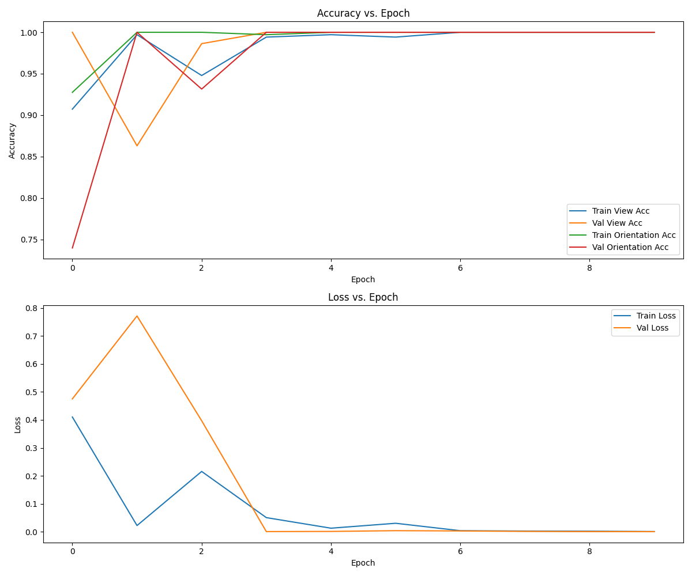

## Table of Contents
- [Training](#training)
  - [Nipple Detector (YOLO)](#nipple-detector-yolo)
  - [Pectoral Muscle Segmentation (U-Net)](#pectoral-muscle-segmentation-u-net)
  - [View-Orientation Classification (Res2Next)](#view-orientation-classification-res2next)
- [Example Outputs](#example-outputs)

## Training

### Nipple Detector (YOLO)

To train the nipple detector:

```
python train/nipple_detector_yolo.py
```

This script uses YOLOv8 for nipple detection. It loads a pre-trained YOLOv8 model and fine-tunes it on mammogram data. The training process includes data augmentation and uses the YOLO-specific loss function.

### Pectoral Muscle Segmentation (U-Net)

To train the pectoral muscle segmentation model:

```
python train/pectoral_muscle_segmentator_512.py
```

This script implements a U-Net architecture for pectoral muscle segmentation. It uses a combination of binary cross-entropy and Dice loss for training. The model is trained on 512x512 pixel images and includes data augmentation techniques.

### View-Orientation Classification (Res2Next)

To train the view-orientation classifier:

```
python train/view_orientation_classifier.py
```

This script uses a Res2Next50 model for classifying mammogram views (CC/MLO) and orientations (Left/Right). It implements a multi-task learning approach, with separate classifiers for view and orientation. The training process includes data augmentation and uses cross-entropy loss.


## Model Performance

### Nipple Detection Model

The Nipple Detection model, based on YOLOv8, was trained for 200 epochs. Here are the final performance metrics:

- **Precision (B)**: 1.0
- **Recall (B)**: 0.98544
- **mAP50 (B)**: 0.99279
- **mAP50-95 (B)**: 0.56041

These results indicate that the Nipple Detection model achieves high accuracy in identifying nipples in mammogram images, with perfect precision and near-perfect recall. The high mAP50 score demonstrates excellent performance at a 50% IoU threshold, while the mAP50-95 score shows good performance across various IoU thresholds.

### Pectoral Muscle Segmentation

### View-Orientation Classification


The View-Orientation Classification model, designed to classify mammogram images by view (CC/MLO) and orientation (Left/Right), demonstrated excellent performance during training.

The model achieved rapid improvement in accuracy for both view and orientation classification, reaching nearly 100% by the fourth epoch. This high accuracy was maintained consistently for both training and validation sets, indicating strong generalization capabilities.
Training and validation losses decreased sharply in the initial epochs and stabilized at very low values, suggesting successful model convergence with minimal overfitting. The final model achieved near-perfect accuracy on both training and validation sets for view and orientation classification.

These results indicate that the View-Orientation Classification model is highly effective at distinguishing between different mammogram views and orientations, a crucial capability for accurate analysis within the MammoQC system.


